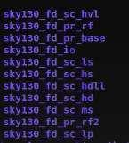

### Sky130 Day 1 - Inception of open-source EDA, OpenLANE and Sky130 PDK
#### Familiarity to open-lane framework

*1.3. SKY130_D1_SK3 - Get familiar to open-source EDA tools*
* L1. OpenLANE directory structure
Desktop/work/tools/open_lane_working_dir/

 

inside pdk folder, 
skywater-pdk has timing libraries, LEF file, TECH lib, cell LEF
open_pdk - Silicon foundry file are made for commercial EDA tools, Open pdk helps to make the pdk compatible with open EDA tools. They are a set of scripts and files to make it compatible, like magic, NETgen, etc tools.

 

sky130A - made compatibe for open source env. sky130A is open source variants. 

sky130A has libs.ref(timing, LEF, tech LEF- specific to the process) and libs.tech(specific to tool)

we work on sky130_fd_sc_hd(processname_foundryname_stdcell_variantofPDK).

libs.ref/sky130_fd_sc_hd has techlef- layer info; mag file, lef, lib [image1.3.1.5]- timing files of all process corners. just LEF is cell LEF, tech LEF(tlef) is technology LEF.

Inside openLANEworkdir, where we are working on. Invoking openLANE tool from this dir. Desktop/work/tools/open_lane_working_dir/openlane

* L2. Design prep

./flow.tcl -interactive(for step by step flow run)

./flow.tcl -design <design_name> for running the complete flow

To import all the packages required to run the flow: 
%package require openlane 0.9

Inside openlane/designs - there are many designs built into openlane. 
We are doing for picorv32a: src, sky130a_sky130_fd_sc_hd_config.tcl

src file - verilog file of rtl netlist & sdc info.
config.tcl[image1.3.2.1] - bypassed any configurations that are set in default. 

Whwn we run our custom design, sky130a_sky130_fd_sc_hd_config.tcl won't be there. 
But we need to create config.tcl file.

order of precedence(priority order), default value set by open lane < config.tcl < sky130a_sky130_fd_sc_hd_config.tcl(optional file)

* L3. Run Synthesis

%prep -design <design_name>

here, %prep -design picorv32a

The new **runs** directory gets created in *openlane/designs/picrorv32a*.

Inside runs/timestamp/, tmp file has 

In the mergerd.lef file, we have tlef info(layer, wire, vias), cell level lef info(macro).

Inside runs/timestamp, we have a config.tcl. In the ENV: It has pdk, lef info, merged.lef, tracks info, tlef info, synthesis takes it's library info from pdks/sky130A/libs.ref/sky130A_fd_sc_hd/lib/file.lib, MIN and MAX libraries.

In open lane, changes can be made to the config file on the fly. 

Eg: Core utilisation change can be done.

%run_synthesis

will run the yosys synthesis as well as the abc.

* L4. Open Lane git results
* L5. Characterising Synthesis results

### Sky130 Day 2 - Good floorplan vs bad floorplan and introduction to library cells
*2.1. SKY130_D2_SK1 - Chip Floor planning considerations*

* L6. Steps to run floorplan using openlane
* L7. Review floorplan files and steps to view floorplan
* L8. Review floorplan layout in Magic

*2.2. SKY130_D2_SK2 - Library Binding and Placement*

* L5. Congestion aware placement using RePlAce

### Sky130 Day 3 - Design library cell using Magic Layout and ngspice characterization
*3.1. SKY130_D3_SK1 - Labs for CMOS inverter ngspice simulations*

* L0. IO placer revision
* L5. Lab steps to git clone vsdstdcelldesign

*3.2. SKY130_D3_SK2 - Inception of Layout – CMOS fabrication process*
* L8. Lab intro to Sky130 basic layers layout & LEF using inverter
* L9. Lab steps to create std layout & extract spice netlist

*3.3. SKY130_D3_SK3 - Sky130 Tech File Labs*
* L1. To create final SPICE deck using Sky130 tech
* L2. To characterize inverter using sky130 model files
* L3. To introduce Magic tool options and DRC rules
* L4. To introduce Sky130 pdk’s and steps to download labs
* L5. To introduce Magic & steps to load Sky130 tech-rules
* L6. To fix poly.9 error in Sky130 tech-file
* L7. To implement poly resistor spacing to diff and tap
* L8. To describe DRC error as geometrical construct

### Sky130 Day 4 - Pre-layout timing analysis and importance of good clock tree
*4.1. SKY130_D4_SK1 - Timing modelling using delay tables*
* L1. To convert grid info to track info
* L2. To convert magic layout to std cell LEF
* L3. To introduce timing libs & steps to include new cell in synthesis
* L7. To configure synthesis settings to fix slack and include vsdinv

*4.2. SKY130_D4_SK2 - Timing analysis with ideal clocks using openSTA*
* L3. To configure OpenSTA for post-synth timing analysis
* L4. To optimize synthesis to reduce setup violations
* L5. To do basic timing ECO

*4.3. SKY130_D4_SK3 - Clock tree synthesis TritonCTS and signal integrity*
* L3. To run CTS using TritonCTS
* L4. To verify CTS runs

*4.4. SKY130_D4_SK4 - Timing analysis with real clocks using openSTA*
* L3. To analyze timing with real clocks using OpenSTA
* L4. To execute OpenSTA with right timing libraries and CTS assignment
* L5. To observe impact of bigger CTS buffers on setup and hold timing

### Sky130 Day 5 - Final steps for RTL2GDS using tritonRoute and openSTA
*5.2. SKY130_D5_SK2 - Power Distribution Network and routing*
* L1. To build power distribution network
* L2. Steps from power straps to std cel power
* L3. Basics of global and detail routing and configure TritonRoute

*5.3. SKY130_D5_SK3 - TritonRoute Features*
* L4. Final files list post-route
